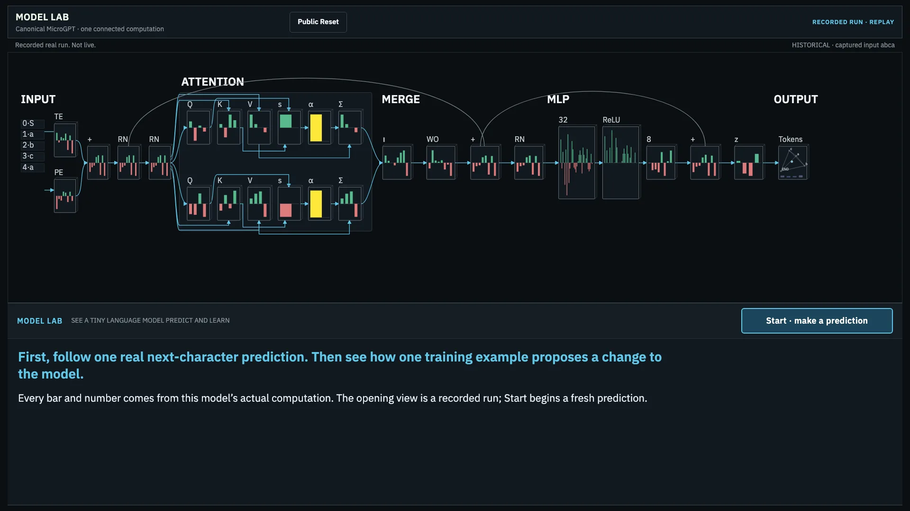
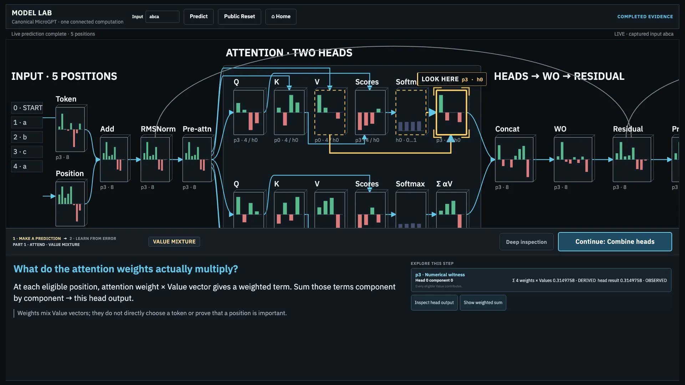

# Model Lab

Model Lab is a local-first, model-independent learning and experimentation workbench.
MicroGPT is the first deeply inspectable implementation, the continuous world is the
preferred presentation, and ABQ is a deployment/workshop profile.

## Target foundation

The [full v2 design and proof plan](docs/README.md) govern the target: native model
integrations, shared evidence/player/inspection, technique variants and controlled
experiments. The target remains subject to independent foundation acceptance;
M0–M4 have scoped engineering qualification, while M5 and M6 have not run. See the
[FP/M status ledger](docs/foundation-status.md). Native Pythia and MLP/SGD are required
complementary implemented witnesses, each with bounded qualification scope.
Full unfamiliar-user testing follows independent foundation acceptance at M5, then M6.
Internal engineering, visual and accessibility review may continue earlier.

## Current implementation

The current public Guided exhibit follows one tiny real transformer through a fresh next-character prediction and a proposed training change. Its opening computation is a recorded replay; **Start · make a prediction** runs a fresh prediction. Part 1 traces the connected forward calculation, and Part 2 traces the objective, backward contribution, completed gradient, Adam proposal, and explicit candidate decision. This teaching-scale model does not provide useful natural-language capability.



Characters become **tokens**: numbered entries in a small vocabulary. Each token ID and its position select vectors of numbers. Attention mixes information from the current and earlier positions; an MLP (a small feed-forward network) transforms those features. The model turns the resulting scores into **probabilities**—shares of the next-token distribution that sum to one.

A **parameter** is an adjustable number used in those calculations. The known next character supplies a target. **Loss** measures how poorly the model predicts the targets; lower loss on this example means it assigned them more probability overall. A **gradient** says how a small parameter change would affect that loss. Training uses gradients and Adam’s saved state to propose new parameter values. The exhibit evaluates that candidate on the same example; the accepted model changes only after **Accept update** succeeds.

The model starts untrained and uses only `a`, `b`, `c`, and a shared start/end marker. One example demonstrates learning mechanics, not useful language understanding. In Guided, a candidate update remains provisional until **Accept update**; **Discard candidate** preserves the accepted model.

## Run locally

Requires Node 24+, npm, and Python 3.9+ for reference validation.

```bash
# From the standalone repository root:
npm ci
npm run dev
```

Open the localhost URL printed by Vite. `npm run dev` builds and serves fixed local assets. After editing source, stop and restart it to rebuild; automatic source hot-reloading is disabled so running workers and their recorded runtime revision stay aligned. The public Guided route begins with Start, advances through Part 1 and Part 2, and asks whether to accept or discard one provisional update. The recorded opening is labeled replay; fresh execution and its numbers are labeled separately. The earlier ten-update Guided measurement remains [historical evidence](docs/guided-measurement.md).

For an explicitly network-reachable HTTP preview, use `npm run dev:network` and open
the printed machine IP. The ordinary browser-local workflow supports such
insecure HTTP origins; the separately installed native Python bridge remains restricted
to its qualified exact-loopback application origin.

The workbench accepts up to seven characters from `a`, `b`, and `c`. The START / END marker is added automatically; the same marker is called BOS in technical views. Edited input makes old evidence visibly stale until Predict runs again. In the public Guided route, selecting a world object opens Explore; **Resume route** returns to the same computation. **Deep inspection** offers Values, Exact Math, Source, and scalar Microscope where available.

Workbench **Reset model** restores the selected or canonical state and preserves history. **Cancel** restores the last completed live state. In the public exhibit, **Public Reset** clears the visitor session and returns to the recorded opening; the default idle policy does this after five minutes without activity, following a 20-second warning.

Live model arithmetic runs in its owning Web Worker. A separate inspector worker reconstructs old runs and verifies all available semantic anchors before returning recomputed detail. No live `Value` object leaves its owner. Core runtime assets are bundled locally: no model API, remote font, dataset download, or WAN access is required after installing/building. Development dependency installation may require Internet access.

## Prepared exhibit

From this repository root, `npm run prepare:abq` builds once and creates a read-only kit in `test-results/abq-overnight/release/`. With Node 24+ already installed, run `node serve.mjs` inside the kit and open `http://127.0.0.1:4173/?presentation=spatial&kiosk=1`. No source checkout, node_modules or network install is needed at startup. The ordinary `/` and `/?presentation=spatial` entries remain available.
The generated launcher keeps loopback as its default; `MODEL_LAB_HOST=0.0.0.0 node serve.mjs`
is the explicit network-bind form.

Start makes a fresh prediction. The public route follows the connected forward world, then one training example through an explicit candidate decision. This is teacher-forced next-token prediction, not generative continuation. Public Reset restores the canonical visitor baseline, clears visitor history, and returns to the recorded opening. The initial idle policy is 300 seconds with a 20-second warning; the facilitator profile offers **Show operator controls → Disable idle reset · facilitated session**. See the [operator runbook](docs/abq-operator-runbook.md) for preparation, recovery and qualification limits.



## Validation

```bash
npm run test:reference   # portable: exact structure/identity + strict numeric conformance
npm test                # scalar conformance, trace, worker/session properties
npm run example         # model-only predict, teach, predict
npm run build           # strict TypeScript and production assets
npx playwright install chromium
npm run test:browser     # real browser Predict, arithmetic, Learn, reset
npm run test:http        # same browser-local system through an insecure HTTP host
```

Or run `npm run acceptance` after installing Chromium. Browser tests use the production build on port 4173. `test:reference` always means portable Python validation (`1e-30 + 1e-12 * abs(canonical)`); `npm run test:reference:canonical` is a separate byte-verification command tied to the [documented environment](reference/PROVENANCE.md#canonical-byte-exact-regeneration). TypeScript full-precision fixture values are compared using `abs(error) <= 1e-10 + 1e-9 * abs(expected)`; UI decimal formatting does not change canonical evidence. See [fixtures](fixtures/README.md), [provenance](reference/PROVENANCE.md), and [Read the Code](READ_THE_CODE.md).

## Isolation and container

From repository root, stage intended Model Lab sources before the tracked-copy check:

```bash
npm run test:isolation
```

This optional check copies tracked repository files to a fresh temporary directory, runs `npm ci`, portable Python/reference and TypeScript tests, model-only example, production build, and browser tests without sibling source. It leaves the temporary copy path in the log for inspection.

From repository root:

```bash
docker build -f Dockerfile -t model-lab:acceptance .
docker run --rm -p 127.0.0.1:8080:80 model-lab:acceptance
```

The container serves static assets only. The browser executes the scalar model. The repository is standalone; no sibling workshop source is required.
The Docker builder installs only the locked compiler, bundler, fonts and production dependencies. Playwright remains a host/CI qualification dependency and is neither installed in the builder nor copied into the runtime image.
For an explicitly network-reachable container, publish with `-p 8080:80` and open the
host's HTTP name or address; retain the loopback mapping when network access is unwanted.

## Scope

This fixture uses one layer, eight embedding features, two heads, eight context positions, three characters plus BOS, and **896 parameters**. Parameter count follows configuration. Model source remains independent of tracing and UI. The evidence player supports immutable replay and explicit missing values; attention arithmetic detail is **derived from observed live Q/K**, not a newly executed model run. Next-token selection uses the highest probability at the selected input position, with no random sampling.

The upstream gist is pinned by revision and SHA-256. The committed Python oracle is independently authored and checked against the original downloaded reference; upstream source is not vendored. The pinned file has no license header; Karpathy later explicitly stated that microgpt is MIT licensed. This pass makes no repository-level licensing decision. See the provenance document for the exact validation command and evidence.

Controlled ablation and matched training-data substitution research are documented in [experiment evidence](docs/experiments-v0.2.md). This slice makes no attack-success or security-effectiveness claims.

## v0.2 evidence and retention

Current Predict retains full private scalar evidence. Learn snapshots actual gradients and every operand contribution before Adam changes parameters or clears gradients. The gradient in the microscope equals the observed gradient consumed by Adam; the optimizer panel expands moments, bias correction, mathematical update and actual representable delta. An advanced whole-run capture exposes measured graph statistics without a graph hairball.

History uses SHA-256 over a canonical binary64 encoding of complete state, including parameter order, moments, schedule, cursor and RNG continuation. The main-thread archive accepts only immutable plain data and validated references. Cached observed detail remains observed; uncaptured historical detail is labelled VERIFIED RECOMPUTATION only after verification passes. A mismatch produces no explanatory graph.

Multi-step training retains every observed loss summary and full experiments at the first step, each loss halving, and final step. Checkpoint comparison uses exact archived runs with compatible model, input, objective, precision, shape and axes. Session capture stops at a conservative 64 MiB evidence estimate (plus one operation of headroom) and asks for Clear session instead of silently deleting history. See [capture benchmark](docs/capture-benchmark.md), [training benchmark](docs/training-benchmark.md), and [v0.2 acceptance](docs/acceptance-v0.2.md).

## Find your starting point

- Run the math without the browser: `npm run example` → [predict, one update, predict](examples/predict-teach.ts).
- Understand the implementation: [Read the Code](READ_THE_CODE.md), beginning with TypeScript `Value` and `backward`.
- Understand evidence, state, and runtime identity: [evidence and operations](docs/evidence-and-operations.md).
- Review historical engineering acceptance: [v0.2.1 acceptance](docs/acceptance-v0.2.1.md). [v0.2](docs/acceptance-v0.2.md) and [v0.1](docs/acceptance.md) remain historical records.
- Review measurements: [Guided selection](docs/guided-measurement.md), [capture](docs/capture-benchmark.md), [training](docs/training-benchmark.md).
- Follow the current exhibit rehearsal: [operator runbook](docs/abq-operator-runbook.md) and [overnight review](docs/abq-overnight-review.md). Historical reports retain their original scope and paths.

**HUMAN TEACHING VALIDATION: PENDING.** Automated acceptance tests verify implementation behavior. After M5 foundation acceptance, use the [short facilitator checklist](docs/teaching-check.md) for M6 unfamiliar-user testing.
