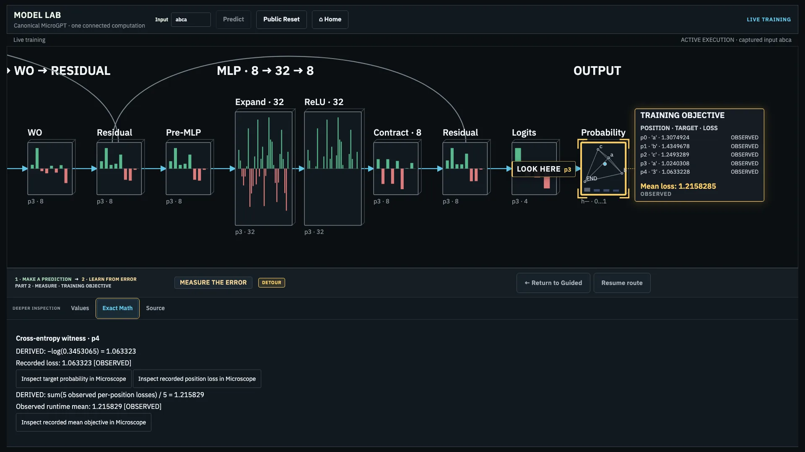
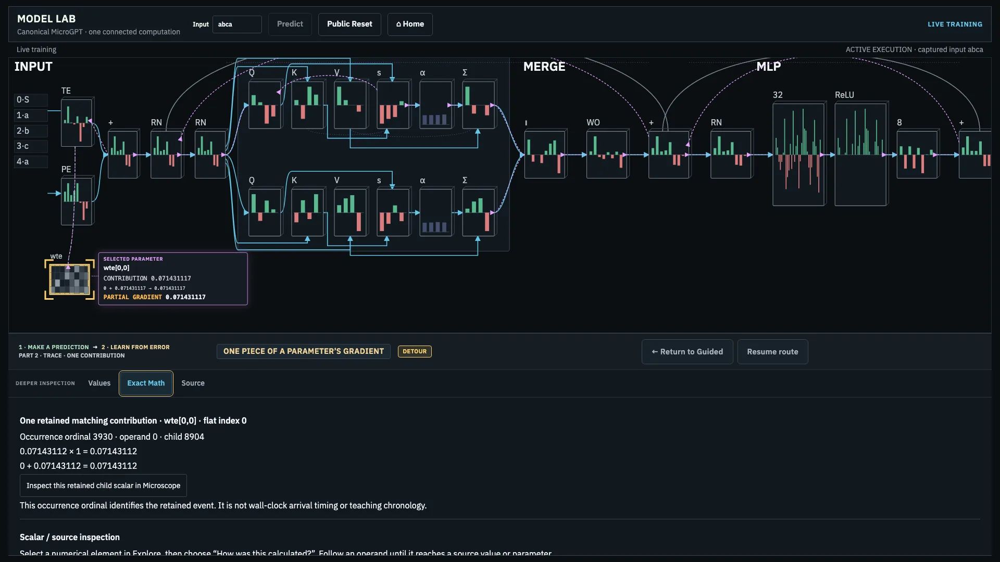

# ABQ presenter and facilitator guide

This guide describes the current Guided exhibit. Full unfamiliar-user teaching and station qualification remain pending after independent M5 review. See the [foundation ledger](foundation-status.md).

## What this exhibit is

This is one very small real transformer using actual model calculations. Its teaching-scale vocabulary and model show mechanisms, not useful natural-language capability. First follow a next-character prediction; then follow how one training example proposes a change.

## 20–30 second orientation

The opening is recorded evidence. Point to **Start · make a prediction** before describing fresh execution.

- “The model has read these characters and predicts which character comes next.”
- “These visible numbers come from its computation. The opening recorded run is replay evidence; Start makes a fresh prediction.”
- “Part 1 follows how that prediction was made. Part 2 follows one proposed training change and lets you decide whether to apply it.”

## Presenter map

Use these chapters as a map, not as button names. Read a displayed value before quoting a number aloud.

| Chapter | Notice and numerical witness | A useful line | Avoid; deepen when useful |
| --- | --- | --- | --- |
| Part 1 · Predict | A next-character distribution; one token probability. | “This is the prediction we will explain.” | Prediction did not update parameters. Inspect the full distribution if asked. |
| Part 1 · Represent | Token and position vectors combine and are normalized; inspect one component. | “Characters and positions become numbers the model can calculate with.” | A component is not a word meaning. Open Values for the component path. |
| Part 1 · Attend | Q, K, V; a signed score, normalized weight, and weighted Value term. | “Scores compare positions; weights mix their Value vectors.” | A weight alone is not a causal explanation. Open Exact Math for the score or mixture. |
| Part 1 · Transform | Attention integration and MLP; inspect one output component. | “Several contributions combine before the saved stream is added.” | Concatenation is not addition. Inspect projection and contraction arithmetic. |
| Part 1 · Output | Signed vocabulary logits become probabilities; inspect one logit and probability. | “Output softmax turns raw scores into a next-character distribution.” | This is separate from attention softmax. Open the complete distribution. |
| Part 2 · Measure | Known targets produce per-position losses and one mean objective. | “The training example gives the model a measurable error.” | The objective spans target positions, not just the one prediction followed earlier. Inspect target losses. |
| Part 2 · Trace | A backward dependency and one retained contribution; inspect the contribution value. | “This use contributes one piece of a parameter’s sensitivity.” | The visual path is not runtime timing. Inspect its operands if available. |
| Part 2 · Accumulate | A running partial and completed gradient; inspect both values. | “The completed gradient gathers more than this retained example row.” | Retained rows are a subset, not complete fan-in. Inspect source and coverage. |
| Part 2 · Propose | Final gradient enters Adam with saved state; inspect before and proposed values. | “Adam proposes a value; the accepted model is still unchanged.” | Gradient is not the update. Open Exact Math for optimizer details. |
| Part 2 · Decide | Baseline and candidate on one example; inspect the named loss or probability comparison. | “Accept applies this candidate; Discard preserves the accepted state.” | One-example improvement is not general improvement. Inspect comparison origins. |

## Part 1 · Make a prediction

At the value mixture, follow the highlighted weight and Value term into the head output; the whole connected computation remains visible.

Press **Start · make a prediction** for fresh execution. The opening display is a recorded run, not live execution. Follow the Guided Continue actions through:

1. **Prediction:** identify the read prefix, next-character distribution, and known target separately. Predicting uses accepted parameters without changing them.
2. **Representation:** token and position embeddings combine; normalization prepares the attention input while an earlier stream is saved. These are numerical features, not semantic understanding.
3. **Q/K/V:** three distinct learned projections of the same normalized input supply comparison and mixture roles.
4. **Attention comparison:** a Query compares with eligible earlier or current Keys to make raw signed scores. A score is not a probability. Future causal Keys are **NOT APPLICABLE**, not zero-valued evidence.
5. **Attention weights:** softmax normalizes the eligible score row. This is not the later vocabulary softmax, and one weight does not explain the entire prediction.
6. **Value mixture:** each eligible weight multiplies a Value vector; the terms sum component by component into a head output.
7. **Attention integration:** head outputs concatenate, WO projects the combined vector, then the saved residual is added. Concatenation, projection, and addition are distinct; WO aggregates multiple contributors.
8. **MLP:** normalization, expansion, ReLU, contraction, and residual addition transform each position. The contraction aggregates multiple contributors.
9. **Vocabulary scores:** logits are raw signed scores, not probabilities.
10. **Output softmax:** vocabulary logits become the next-character distribution. The forward recap reconnects Represent, Attend, Transform, and Output; prediction itself did not train the model.

## Part 2 · Learn from error

The objective uses known targets at multiple positions, rather than only the prediction followed in Part 1.

Use this retained contribution to distinguish a running partial from the completed gradient.

Use **Part 2 · learn from an example** at the forward recap, then follow the Guided Continue actions.

1. **Objective:** known targets at multiple positions yield per-position loss and one mean training objective.
2. **Backward dependency:** the path explains dependency and sensitivity. Visual movement does not measure execution order or runtime timing. Structural relationships alone do not supply missing numerical adjoints.
3. **Retained contribution:** one parameter use supplies one contribution to a running partial gradient. Retained rows are only a subset of all contributors.
4. **Completed gradient:** the final value is the completed backward result for the selected parameter. It is not the new parameter value or an optimizer update.
5. **Adam proposal:** the final gradient and saved optimizer state produce a provisional proposed value. The accepted model is unchanged.
6. **Candidate comparison:** the candidate is rerun and compared with the baseline on this training example. Quote a lower loss only if the displayed evidence supports it for this example. This does not establish general improvement.
7. **Decision:** **Accept update** commits the candidate parameters and optimizer state when the action completes. **Discard candidate** preserves the prior accepted state. The completion view names the outcome.

## Optional depth and Explore

Guided offers **Deep inspection**, then **Values**, **Exact Math**, and **Source**; selected scalar routes open **Microscope** where available. **Return to Guided** closes depth. Select a world object to Explore, then use **Resume route** to return to the same Guided computation and selection. These views inspect the same authentic computation identity; opening detail does not itself rerun it. Some optional evidence may be unavailable. Missing is not zero. Read origin and availability labels: **OBSERVED**, **DERIVED**, **RECOMPUTED**, **STRUCTURAL**, **INTERPRETED**, and **UNAVAILABLE** have different meanings.

## Encounter shapes

- **Quick orientation:** Start, read the prediction, show one representation or attention witness, and name Part 2 as a proposed change.
- **Standard Guided walkthrough:** follow the connected forward recap, then objective, contribution, final gradient, proposal, comparison, and explicit decision.
- **Deep inspection walkthrough:** pause at a score, mixture, scalar gradient, or Adam proposal to open Values, Exact Math, Source, or Microscope. Return to Guided before continuing.

These are presenter choices, not measured completion times or validated learning outcomes.

## Truth guardrails

| Do say | Do not say |
| --- | --- |
| “This recorded opening is replay evidence”; “this fresh prediction is live execution.” | “The model is thinking”; “replay is live execution.” |
| “This path shows dependency and sensitivity.” | “Backprop runs backward at the speed of this animation.” |
| “This is one retained gradient contribution”; “this is the completed gradient.” | “These retained rows are the whole gradient.” |
| “Adam proposes this value; acceptance is a separate action.” | “The gradient changed the parameter”; “Adam already updated the model.” |
| “The candidate lowered loss on this example,” only when the displayed comparison supports it. | “The candidate is better”; “this proves generalization.” |
| “This attention weight is one mixing coefficient.” | “Attention tells us why the model predicted this.” |
